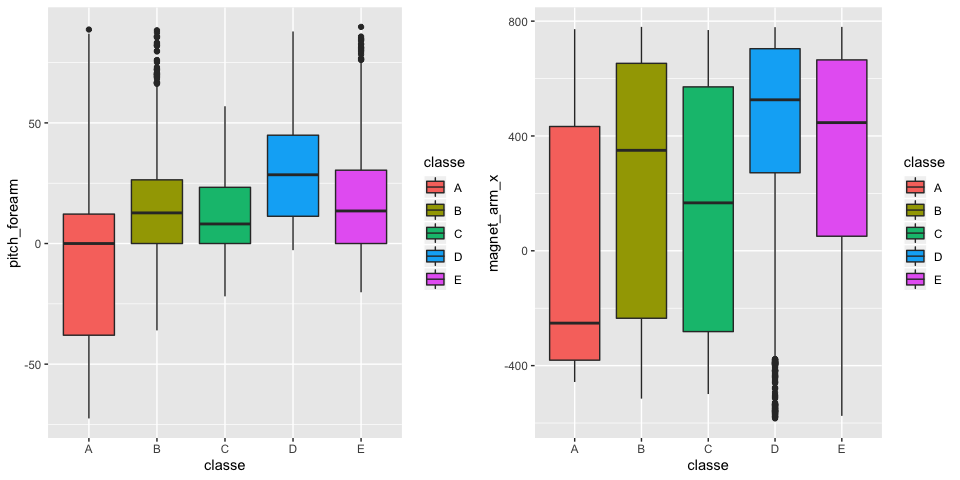
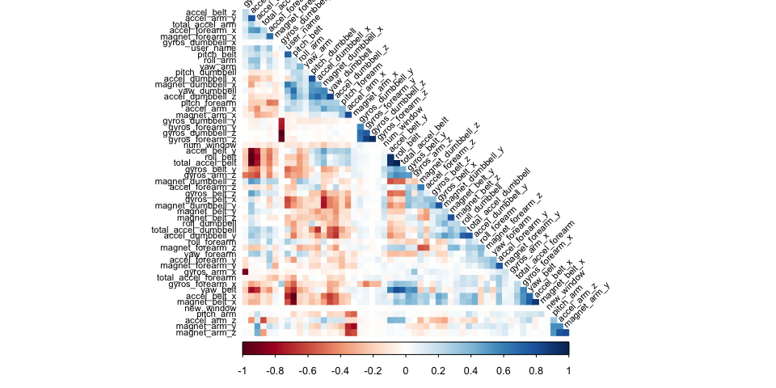
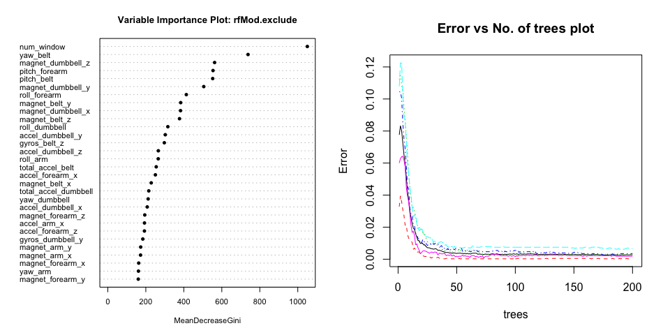
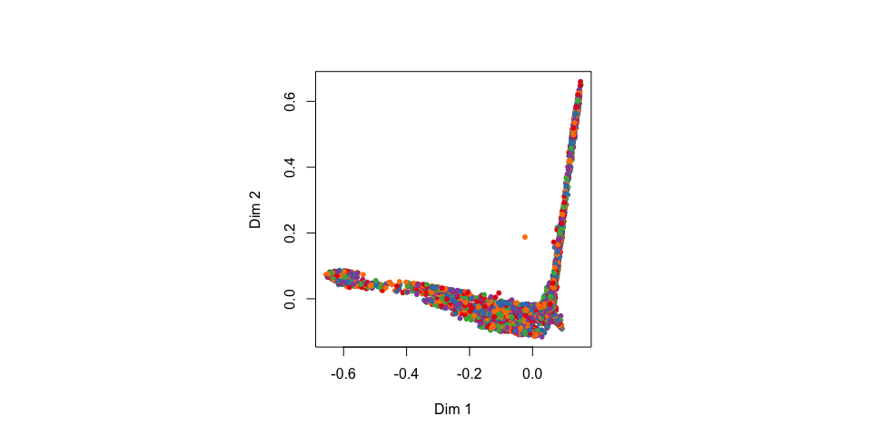
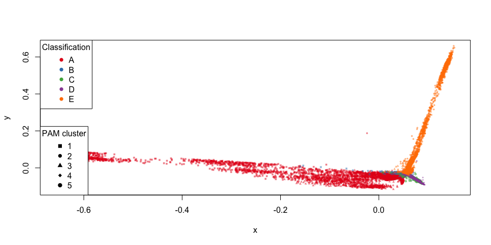

## Executive Summary

Based on a dataset provided by HAR [http://groupware.les.inf.puc-rio.br/har](http://groupware.les.inf.puc-rio.br/har).
Data source (http://web.archive.org/web/20161224072740/http:/groupware.les.inf.puc-rio.br/har).
We will try to train a predictive model to predict what exercise was performed using a dataset with 159 features.

We'll take the following steps:

- Process the data, for use of this project.
- Explore the data, especially focussing on the two paramaters we are interested in.
- Model selection, trying different models to help us answer our questions.
- Model examination, whether our best model holds up to our standards.
- A Conclusion that answers the questions based on the data analysis.
- Predict the classification of test data with the selected model.

## Data Processing

```r
url_train<-"https://d396qusza40orc.cloudfront.net/predmachlearn/pml-training.csv"
download.file(url_train, destfile="pml-training.csv", method="curl")
url_test<-"https://d396qusza40orc.cloudfront.net/predmachlearn/pml-testing.csv"
download.file(url_test, destfile="pml-testing.csv", method="curl")
training.raw <- read.csv("pml-training.csv")
testing.raw <- read.csv("pml-testing.csv")
```

## Data Pre-processing
Look at the dimensions & head of the dataset to overview.

```r
# Res 1
dim(training.raw)
```

```
## [1] 19622   160
```

```r
# Res 2 - omitted for brevity
# head(training.raw)
# Res 3 - omitted for brevity
# str(training.raw)
# Res 4 - omitted for brevity
# summary(training.raw)
```

Lots of NA or missing value. Let's remove them.


```r
maxNAPerc = 20
maxNACount <- nrow(training.raw) / 100 * maxNAPerc
removeColumns <- which(colSums(is.na(training.raw) | training.raw=="") > maxNACount)
training.cleaned01 <- training.raw[,-removeColumns]
testing.cleaned01 <- testing.raw[,-removeColumns]
```

Also remove all time-related data, because we don't need them.


```r
removeColumns <- grep("timestamp", names(training.cleaned01))
training.cleaned02 <- training.cleaned01[,-c(1, removeColumns )]
testing.cleaned02 <- testing.cleaned01[,-c(1, removeColumns )]
```

Then convert all factors to integers.

```r
classeLevels <- levels(training.cleaned02$classe)
training.cleaned03 <- data.frame(data.matrix(training.cleaned02))
training.cleaned03$classe <- factor(training.cleaned03$classe, labels=classeLevels)
testing.cleaned03 <- data.frame(data.matrix(testing.cleaned02))
```

Finally make the dataset ready and tidy.


```r
training.cleaned <- training.cleaned03
testing.cleaned <- testing.cleaned03
```

## Exploratory Data Analyses 

Since the test set provided is the the ultimate validation set, we will split the current training in a test and train set to work with.


```r
set.seed(620413)
library(caret)
classeIndex <- which(names(training.cleaned) == "classe")
partition <- createDataPartition(y=training.cleaned$classe, p=0.75, list=FALSE)
training.subSetTrain <- training.cleaned[partition, ]
training.subSetTest <- training.cleaned[-partition, ]
```

What are some fields that have high correlations with the classe?


```r
correlations <- cor(training.subSetTrain[, -classeIndex], as.numeric(training.subSetTrain$classe))
bestCorrelations <- subset(as.data.frame(as.table(correlations)), abs(Freq)>0.3)
bestCorrelations
```

```
##             Var1 Var2      Freq
## 44 pitch_forearm    A 0.3443476
```

Even the best correlations with classe are hardly above 0.3.
Let's check visually if there is indeed hard to use these 2 as possible simple linear predictors.


```r
library(Rmisc)
library(ggplot2)
p1 <- ggplot(training.subSetTrain, aes(classe,pitch_forearm)) + 
  geom_boxplot(aes(fill=classe))
p2 <- ggplot(training.subSetTrain, aes(classe, magnet_arm_x)) + 
  geom_boxplot(aes(fill=classe))
multiplot(p1,p2,cols=2)
```

<!-- -->

Clearly there is no hard seperation of classes possible using only these 'highly' correlated features.
Let's train some models to get closer to a way of predicting these classe's.

## Model Selection 

Let's identify variables with high correlations among each other in our set, so we can possibly exclude them from the pca or training. 

We will check afterwards if these modifications to the dataset make the model more accurate and perhaps even faster.


```r
library(corrplot)
correlationMatrix <- cor(training.subSetTrain[, -classeIndex])
highlyCorrelated <- findCorrelation(correlationMatrix, cutoff=0.9, exact=TRUE)
excludeColumns <- c(highlyCorrelated, classeIndex)
corrplot(correlationMatrix, method="color", type="lower", order="hclust", tl.cex=0.70, tl.col="black", tl.srt = 45, diag = FALSE)
```

<!-- -->

We see that there are some features that are quite correlated with each other.
We will have a model with these excluded. Also we'll try and reduce the features by running PCA on all and the excluded a subset of these features.


```r
pcaPreProcess.all <- preProcess(training.subSetTrain[, -classeIndex], method = "pca", thresh = 0.99)
training.subSetTrain.pca.all <- predict(pcaPreProcess.all, training.subSetTrain[, -classeIndex])
training.subSetTest.pca.all <- predict(pcaPreProcess.all, training.subSetTest[, -classeIndex])
testing.pca.all <- predict(pcaPreProcess.all, testing.cleaned[, -classeIndex])
pcaPreProcess.subset <- preProcess(training.subSetTrain[, -excludeColumns], method = "pca", thresh = 0.99)
training.subSetTrain.pca.subset <- predict(pcaPreProcess.subset, training.subSetTrain[, -excludeColumns])
training.subSetTest.pca.subset <- predict(pcaPreProcess.subset, training.subSetTest[, -excludeColumns])
testing.pca.subset <- predict(pcaPreProcess.subset, testing.cleaned[, -classeIndex])
```

Now we'll do some actual Random Forest training.
We would use 200 trees, because we want it to be thorough even the error rates do not decline so much after 50 trees.
Also we will time the 4 random forest models to find the fastest.


```r
library(randomForest)
ntree <- 200 #Enough for an acceptable accuracy. 
start <- proc.time()
rfMod.cleaned <- randomForest(
  x=training.subSetTrain[, -classeIndex], 
  y=training.subSetTrain$classe,
  xtest=training.subSetTest[, -classeIndex], 
  ytest=training.subSetTest$classe, 
  ntree=ntree,
  keep.forest=TRUE,
  proximity=TRUE) #do.trace=TRUE
proc.time() - start
```

```
##    user  system elapsed 
## 143.270   4.156 151.907
```

```r
start <- proc.time()
rfMod.exclude <- randomForest(
  x=training.subSetTrain[, -excludeColumns], 
  y=training.subSetTrain$classe,
  xtest=training.subSetTest[, -excludeColumns], 
  ytest=training.subSetTest$classe, 
  ntree=ntree,
  keep.forest=TRUE,
  proximity=TRUE) #do.trace=TRUE
proc.time() - start
```

```
##    user  system elapsed 
## 139.680   4.981 155.274
```

```r
start <- proc.time()
rfMod.pca.all <- randomForest(
  x=training.subSetTrain.pca.all, 
  y=training.subSetTrain$classe,
  xtest=training.subSetTest.pca.all, 
  ytest=training.subSetTest$classe, 
  ntree=ntree,
  keep.forest=TRUE,
  proximity=TRUE) #do.trace=TRUE
proc.time() - start
```

```
##    user  system elapsed 
## 132.507   4.562 144.154
```

```r
start <- proc.time()
rfMod.pca.subset <- randomForest(
  x=training.subSetTrain.pca.subset, 
  y=training.subSetTrain$classe,
  xtest=training.subSetTest.pca.subset, 
  ytest=training.subSetTest$classe, 
  ntree=ntree,
  keep.forest=TRUE,
  proximity=TRUE) #do.trace=TRUE
proc.time() - start
```

```
##    user  system elapsed 
## 128.521   4.174 134.091
```

## Model Examination

With the 4 trained models, we will check their accuracy and error rates, and then pick the best one.


```r
rfMod.cleaned
```

```
## 
## Call:
##  randomForest(x = training.subSetTrain[, -classeIndex], y = training.subSetTrain$classe,      xtest = training.subSetTest[, -classeIndex], ytest = training.subSetTest$classe,      ntree = ntree, proximity = TRUE, keep.forest = TRUE) 
##                Type of random forest: classification
##                      Number of trees: 200
## No. of variables tried at each split: 7
## 
##         OOB estimate of  error rate: 0.27%
## Confusion matrix:
##      A    B    C    D    E  class.error
## A 4183    1    0    0    1 0.0004778973
## B    6 2840    2    0    0 0.0028089888
## C    0    4 2562    1    0 0.0019477990
## D    0    0   18 2392    2 0.0082918740
## E    0    0    0    5 2701 0.0018477458
##                 Test set error rate: 0.37%
## Confusion matrix:
##      A   B   C   D   E class.error
## A 1395   0   0   0   0 0.000000000
## B    3 946   0   0   0 0.003161222
## C    0   5 850   0   0 0.005847953
## D    0   0   6 797   1 0.008706468
## E    0   0   0   3 898 0.003329634
```

```r
rfMod.cleaned.training.acc <- round(1-sum(rfMod.cleaned$confusion[, 'class.error']),3)
paste0("Accuracy on training: ",rfMod.cleaned.training.acc)
```

```
## [1] "Accuracy on training: 0.985"
```

```r
rfMod.cleaned.testing.acc <- round(1-sum(rfMod.cleaned$test$confusion[, 'class.error']),3)
paste0("Accuracy on testing: ",rfMod.cleaned.testing.acc)
```

```
## [1] "Accuracy on testing: 0.979"
```

```r
rfMod.exclude
```

```
## 
## Call:
##  randomForest(x = training.subSetTrain[, -excludeColumns], y = training.subSetTrain$classe,      xtest = training.subSetTest[, -excludeColumns], ytest = training.subSetTest$classe,      ntree = ntree, proximity = TRUE, keep.forest = TRUE) 
##                Type of random forest: classification
##                      Number of trees: 200
## No. of variables tried at each split: 6
## 
##         OOB estimate of  error rate: 0.27%
## Confusion matrix:
##      A    B    C    D    E  class.error
## A 4183    1    0    0    1 0.0004778973
## B    4 2840    3    0    1 0.0028089888
## C    0    8 2558    1    0 0.0035060382
## D    0    0   16 2396    0 0.0066334992
## E    0    0    0    5 2701 0.0018477458
##                 Test set error rate: 0.35%
## Confusion matrix:
##      A   B   C   D   E class.error
## A 1395   0   0   0   0 0.000000000
## B    1 947   1   0   0 0.002107482
## C    0   5 850   0   0 0.005847953
## D    0   0   6 797   1 0.008706468
## E    0   0   0   3 898 0.003329634
```

```r
rfMod.exclude.training.acc <- round(1-sum(rfMod.exclude$confusion[, 'class.error']),3)
paste0("Accuracy on training: ",rfMod.exclude.training.acc)
```

```
## [1] "Accuracy on training: 0.985"
```

```r
rfMod.exclude.testing.acc <- round(1-sum(rfMod.exclude$test$confusion[, 'class.error']),3)
paste0("Accuracy on testing: ",rfMod.exclude.testing.acc)
```

```
## [1] "Accuracy on testing: 0.98"
```

```r
rfMod.pca.all
```

```
## 
## Call:
##  randomForest(x = training.subSetTrain.pca.all, y = training.subSetTrain$classe,      xtest = training.subSetTest.pca.all, ytest = training.subSetTest$classe,      ntree = ntree, proximity = TRUE, keep.forest = TRUE) 
##                Type of random forest: classification
##                      Number of trees: 200
## No. of variables tried at each split: 6
## 
##         OOB estimate of  error rate: 2%
## Confusion matrix:
##      A    B    C    D    E class.error
## A 4157   13    2    9    4 0.006690562
## B   40 2780   22    3    3 0.023876404
## C    2   32 2512   19    2 0.021425789
## D    2    1  102 2300    7 0.046434494
## E    1    8   13    9 2675 0.011456024
##                 Test set error rate: 1.69%
## Confusion matrix:
##      A   B   C   D   E  class.error
## A 1394   1   0   0   0 0.0007168459
## B   13 927   7   2   0 0.0231822972
## C    3  10 840   1   1 0.0175438596
## D    1   0  31 771   1 0.0410447761
## E    0   3   5   4 889 0.0133185350
```

```r
rfMod.pca.all.training.acc <- round(1-sum(rfMod.pca.all$confusion[, 'class.error']),3)
paste0("Accuracy on training: ",rfMod.pca.all.training.acc)
```

```
## [1] "Accuracy on training: 0.89"
```

```r
rfMod.pca.all.testing.acc <- round(1-sum(rfMod.pca.all$test$confusion[, 'class.error']),3)
paste0("Accuracy on testing: ",rfMod.pca.all.testing.acc)
```

```
## [1] "Accuracy on testing: 0.904"
```

```r
rfMod.pca.subset
```

```
## 
## Call:
##  randomForest(x = training.subSetTrain.pca.subset, y = training.subSetTrain$classe,      xtest = training.subSetTest.pca.subset, ytest = training.subSetTest$classe,      ntree = ntree, proximity = TRUE, keep.forest = TRUE) 
##                Type of random forest: classification
##                      Number of trees: 200
## No. of variables tried at each split: 6
## 
##         OOB estimate of  error rate: 2.34%
## Confusion matrix:
##      A    B    C    D    E class.error
## A 4160   12    4    5    4 0.005973716
## B   59 2755   30    3    1 0.032654494
## C    5   33 2505   21    3 0.024152707
## D    4    5  104 2290    9 0.050580431
## E    0   11   18   14 2663 0.015890613
##                 Test set error rate: 2.22%
## Confusion matrix:
##      A   B   C   D   E class.error
## A 1391   1   2   1   0 0.002867384
## B   16 922   9   2   0 0.028451001
## C    4  11 830   9   1 0.029239766
## D    0   0  41 761   2 0.053482587
## E    1   0   3   6 891 0.011098779
```

```r
rfMod.pca.subset.training.acc <- round(1-sum(rfMod.pca.subset$confusion[, 'class.error']),3)
paste0("Accuracy on training: ",rfMod.pca.subset.training.acc)
```

```
## [1] "Accuracy on training: 0.871"
```

```r
rfMod.pca.subset.testing.acc <- round(1-sum(rfMod.pca.subset$test$confusion[, 'class.error']),3)
paste0("Accuracy on testing: ",rfMod.pca.subset.testing.acc)
```

```
## [1] "Accuracy on testing: 0.875"
```

## Conclusion

1. PCA has no considerable effect on the accuracy or the processing time.
2. The `rfMod.exclude` model performs slightly better than the 'rfMod.cleaned' model, and much better than the other two models, in terms of the processing time, the accuracy, and the OOB error rate.

The `rfMod.exclude` model is selected as the best model for predicting the test data.

Before doing the final prediction, we will examine the chosen model in more depth using some plots.


```r
par(mfrow=c(1,2)) 
varImpPlot(rfMod.exclude, cex=0.7, pch=16, main='Variable Importance Plot: rfMod.exclude')
plot(rfMod.exclude, , cex=0.7, main='Error vs No. of trees plot')
```

<!-- -->

```r
par(mfrow=c(1,1)) 
```

To look in depth at the distances between predictions, we can use MDSplot and cluster predictions and results.


```r
start <- proc.time()
library(RColorBrewer)
palette <- brewer.pal(length(classeLevels), "Set1")
rfMod.mds <- MDSplot(rfMod.exclude, as.factor(classeLevels), k=2, pch=20, palette=palette)
```

<!-- -->

```r
library(cluster)
rfMod.pam <- pam(1 - rfMod.exclude$proximity, k=length(classeLevels), diss=TRUE)
plot(
  rfMod.mds$points[, 1], 
  rfMod.mds$points[, 2], 
  pch=rfMod.pam$clustering+14, 
  col=alpha(palette[as.numeric(training.subSetTrain$classe)],0.5), 
  bg=alpha(palette[as.numeric(training.subSetTrain$classe)],0.2), 
  cex=0.5,
  xlab="x", ylab="y")
legend("bottomleft", legend=unique(rfMod.pam$clustering), pch=seq(15,14+length(classeLevels)), title = "PAM cluster")
  legend("topleft", legend=classeLevels, pch = 16, col=palette, title = "Classification")
```

<!-- -->

```r
proc.time() - start
```

```
##     user   system  elapsed 
## 5216.391   69.324 5691.305
```

# Test Results

Although we've chosen the `rfMod.exclude` model, we also check the other three models for their predictions on the final test data.
Let's look at predictions for all models on the final test data. 


```r
predictions <- t(cbind(
    exclude=as.data.frame(predict(rfMod.exclude, testing.cleaned[, -excludeColumns]), optional=TRUE),
    cleaned=as.data.frame(predict(rfMod.cleaned, testing.cleaned), optional=TRUE),
    pcaAll=as.data.frame(predict(rfMod.pca.all, testing.pca.all), optional=TRUE),
    pcaExclude=as.data.frame(predict(rfMod.pca.subset, testing.pca.subset), optional=TRUE)
))
predictions
```

```
##            1   2   3   4   5   6   7   8   9   10  11  12  13  14  15  16  17  18  19  20 
## exclude    "B" "A" "B" "A" "A" "E" "D" "B" "A" "A" "B" "C" "B" "A" "E" "E" "A" "B" "B" "B"
## cleaned    "B" "A" "B" "A" "A" "E" "D" "B" "A" "A" "B" "C" "B" "A" "E" "E" "A" "B" "B" "B"
## pcaAll     "B" "A" "B" "A" "A" "E" "D" "B" "A" "A" "B" "C" "B" "A" "E" "E" "A" "B" "B" "B"
## pcaExclude "B" "A" "A" "A" "A" "E" "D" "B" "A" "A" "B" "C" "B" "A" "E" "E" "A" "B" "B" "B"
```

The predictions don't really vary a lot with each model.
Here we select the `rfMod.exclude` model as the final answer.

